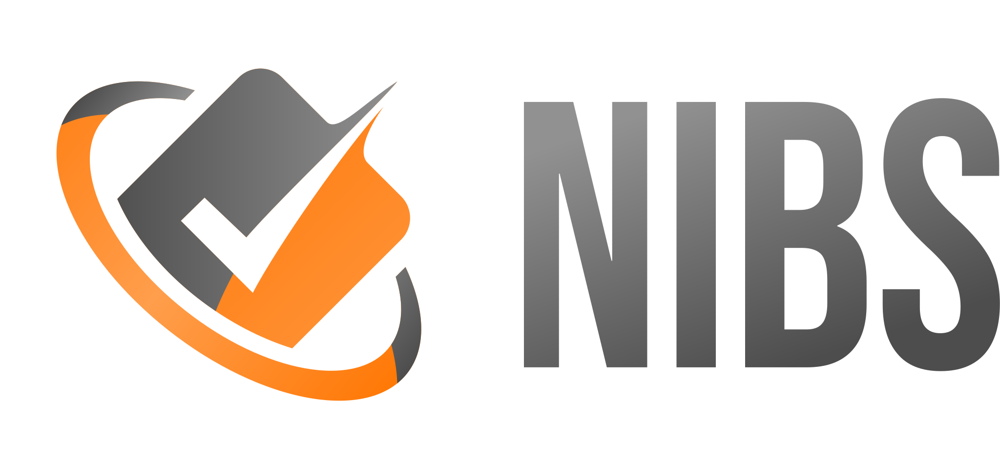

<p align="center">
  <picture>
    <!-- Two variants rather than one, because no single wordmark color works on
         both of GitHub's backdrops: white is 1.00:1 on the light theme and the
         gray-gradient wordmark is 2.24:1 on the dark one. See
         assets/logo/README.md. -->
    <source media="(prefers-color-scheme: dark)" srcset="assets/logo/banner-white-text.svg">
    
  </picture>
</p>

# Nibs

A file-based issue tracker designed for AI-first workflows. Track tasks, bugs, and features as plain Markdown files right alongside your code — readable by humans, queryable by coding agents.

Originally forked from [hmans/beans](https://github.com/hmans/beans).

## Why Nibs?

Most issue trackers live outside your codebase. Your coding agent can't see them, can't search them, and can't update them. Nibs fixes this by storing issues as Markdown files in your repo, with a GraphQL query engine that gives agents exactly the context they need.

- **Your agent tracks its own work.** Nibs replaces in-context todo lists with persistent, structured issues that survive across sessions and compactions.
- **Everything is a file.** Issues are Markdown with YAML front matter in a `.nibs/` directory — version-controlled, diffable, and editable with any tool.
- **Hierarchy and relationships.** Milestones contain epics contain features contain tasks. Blocking/blocked-by relationships prevent your agent from starting work that depends on unfinished prerequisites.
- **Built-in GraphQL.** Agents query for exactly the fields they need, filter by status/type/priority, traverse relationships, and execute mutations — all from the CLI.

## Interfaces

Nibs provides three ways to interact with your issues:

- **CLI** (`nibs`) — Create, list, update, archive, and query nibs from the command line. All commands support `--json` for machine-readable output.
- **Web UI** (`nibs web`) — A Svelte-based web interface with a tree table, inline editing, drag-drop reordering, and a detail panel. Runs a local server.
- **TUI** (`nibs tui`) — A terminal UI built with Bubbletea for browsing and managing nibs without leaving the terminal.

## Installation

### Linux / macOS

```bash
curl -sSfL https://raw.githubusercontent.com/alphaleonis/nibs/main/install.sh | sh
```

Installs to `~/.local/bin` by default. Use `-b DIR` to change the install directory:

```bash
curl -sSfL https://raw.githubusercontent.com/alphaleonis/nibs/main/install.sh | sh -s -- -b /usr/local/bin
```

### Windows (PowerShell)

```powershell
irm https://raw.githubusercontent.com/alphaleonis/nibs/main/install.ps1 | iex
```

Installs to `~/.local/bin` by default.

### From Source

Requires [mise](https://mise.jdx.dev/), which installs the pinned Go, Node, Task, and golangci-lint from `mise.toml`:

```bash
git clone https://github.com/alphaleonis/nibs.git
cd nibs
mise trust                # fresh clone: let mise read this checkout's mise.toml
mise install              # installs pinned Go, Node, Task, golangci-lint
mise exec -- task build   # or put mise's tools on PATH first — see below
```

`mise trust` is needed once per fresh clone: mise refuses to read a `mise.toml` it has not been told to trust. A terminal offers to trust it interactively, but a non-interactive run — CI, a pre-commit hook, a coding agent — only sees the refusal.

`mise install` downloads the tools but does not put them on your PATH. Either add its shims directory to PATH — `~/.local/share/mise/shims`, or `%LOCALAPPDATA%\mise\shims` ([Unverified] on Windows) — or activate mise in your shell profile. `mise activate <shell>` only prints the activation script, so eval it: `eval "$(mise activate zsh)"`; see [mise's docs](https://mise.jdx.dev/getting-started.html) for other shells. Without one of those, `go`, `task` and `node` fall back to whatever is installed system-wide instead of the pinned versions. Any pinned tool can also be run as a one-off without touching PATH: `mise exec -- go version`. For the linter, use `task lint` — it already runs through mise and checks its prerequisites first. `task lint` fetches the pinned golangci-lint over the network on first use if `mise install` has not already cached it, so run `mise install` ahead of time in network-restricted environments.

Prebuilt binaries are also available on the [Releases](https://github.com/alphaleonis/nibs/releases) page.

### Updating

nibs notifies you when a newer release is available — a trailing line on the CLI, a footer hint in the TUI, and a banner in the web UI. To upgrade in place:

```bash
nibs upgrade            # download, verify, and replace the running binary (rolls back on failure)
nibs upgrade --check    # just report whether an update is available
```

If nibs was installed by a package manager (Homebrew, Nix, Scoop, Chocolatey, WinGet, or `go install`), `nibs upgrade` defers to that manager with guidance instead of replacing the binary itself. Set `NIBS_NO_UPDATE_CHECK=1` to silence the update notifications.

## Quick Start

Initialize nibs in your project:

```bash
nibs init
```

This creates a `.nibs/` store directory holding `config.yml` and `data/`. It should be tracked in version control.

```bash
nibs new "Set up CI pipeline" -t task    # create a task
nibs list                                # list all nibs
nibs tui                                 # interactive terminal UI
nibs web                                 # open the web UI in your browser
```

## Agent Integration

Nibs is designed to be used by coding agents like Claude Code, Cursor, Windsurf, and others. The `nibs prime` command outputs a slim prompt with mandatory workflow rules and a directive for the agent to load the full reference (`nibs prime --full`) before using any nibs commands. The slim default is what you want wired to a session-start hook; the full reference is fetched on demand.

### Claude Code

Add a `SessionStart` hook so the agent loads nibs context at the start of every conversation. Adding a `PreCompact` hook ensures the context is reloaded after the conversation history is compacted.

In `.claude/settings.json`:

```json
{
  "hooks": {
    "SessionStart": [
      { "hooks": [{ "type": "command", "command": "nibs prime" }] }
    ],
    "PreCompact": [
      { "hooks": [{ "type": "command", "command": "nibs prime" }] }
    ]
  }
}
```

### Other Agents

Add the following instruction to your project's agent configuration file (e.g., `CLAUDE.md`, `.cursorrules`, `.windsurfrules`):

```
**IMPORTANT**: Run the `nibs prime` command and follow its output.
```

Or, if your agent framework supports startup hooks, wire `nibs prime` to run at session start.

## Key Commands

| Command | Description |
|---------|-------------|
| `nibs init` | Initialize a new nibs project |
| `nibs new` | Create a new nib (milestone, epic, feature, task, bug, or research) |
| `nibs list` | List nibs with filtering by status, type, priority, tags |
| `nibs get <id>` | Display one or more nibs (full document by default) |
| `nibs set <id>` | Update a nib's metadata and links, or clear a field |
| `nibs body <id>` | Edit a nib's Markdown body (set, append, or replace sections) |
| `nibs mv <id>` | Reposition a nib among its siblings or reparent it |
| `nibs close <id>` | Close a nib with a summary; `--as <closed status>` picks the close reason (default `completed`). Closing an existing nib goes through `close` — `nibs set -s <closed status>` is refused |
| `nibs context` | Show project status summary with progress |
| `nibs plan <id>` | View an ordered plan of a parent nib's children |
| `nibs query` | Run a GraphQL query or mutation |
| `nibs roadmap` | Generate a Markdown roadmap from milestones and epics |
| `nibs check` | Validate configuration and data integrity |
| `nibs web` | Start the web UI server |
| `nibs tui` | Open the terminal UI |
| `nibs prime` | Output the agent integration prompt (slim default; pass `--full` for the complete reference) |
| `nibs archive` | Move closed nibs to the archive |
| `nibs upgrade` | Update nibs to the latest release (checksum-verified, with rollback); `--check` to only check |

Run `nibs <command> --help` for full usage details.

## Data Model

Each nib has:

- **Type**: milestone, epic, feature, task, bug, or research
- **Status**: open (in-progress, todo, draft) or closed (deferred, completed, scrapped). Open is a workflow position, closed a close reason. A `deferred` nib is closed but still blocks whatever depends on it — the work is coming back, so the dependency is unmet.
- **Priority** (optional): critical, high, normal, or low
- **Estimate** (optional): s, m, l, or xl (t-shirt sizes)
- **Tags**: freeform labels for categorization
- **Relationships**: parent/child hierarchy, blocking/blocked-by dependencies, document links

Nibs are stored as individual Markdown files in `.nibs/`, with YAML front matter for metadata and Markdown body for description and notes. Archived nibs move to `.nibs/archive/` and remain queryable.

## License

Licensed under the Apache-2.0 License. See [LICENSE.md](LICENSE.md) for details.
